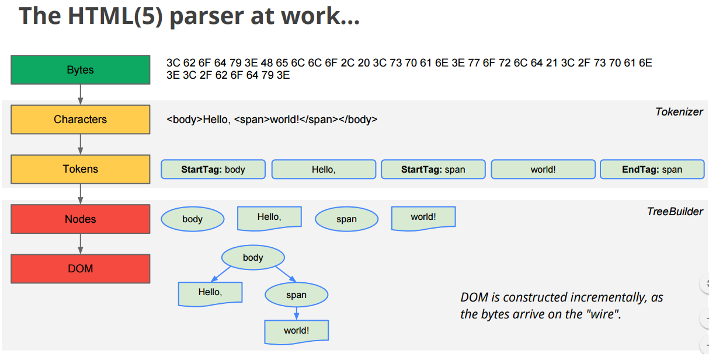
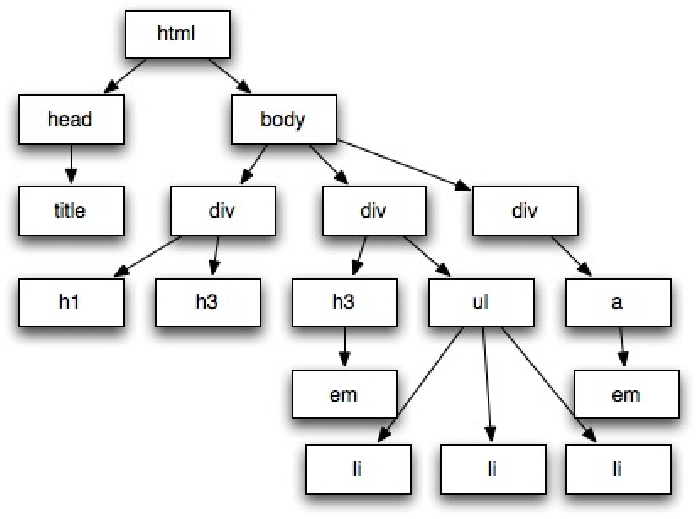
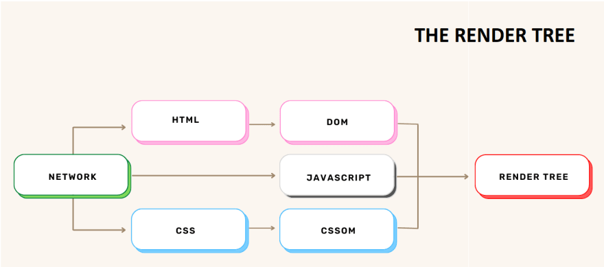
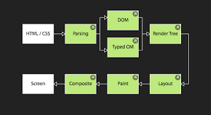

# Table of Contents

- [HTML Notes](#html-notes)
  - [HTML explanation](#html-explanation)
  
    - [1. HTML Introduction](#1-html-introduction)
    - [2. HTML Document Structure](#2-html-document-structure)
    - [3. HTML Elements](#3-html-elements)
    - [4. Headings and Paragraphs](#4-headings-and-paragraphs)
    - [5. Links](#5-links)
    - [6. Images](#6-images)
    - [7. Lists](#7-lists)
    - [8. Tables](#8-tables)
    - [9. Forms](#9-forms)
    - [10. HTML Semantic Elements](#10-html-semantic-elements)
    - [11. HTML5 Features](#11-html5-features)
    - [12. HTML Entities](#12-html-entities)
  - [Table of tags ](#table-of-tags)


# HTML Notes

HTML (Hypertext Markup Language) is the standard markup language used for creating web pages. It provides the structure and content of a webpage, defining elements such as headings, paragraphs, links, images, tables, and more.

HTML uses tags to define the structure and presentation of the content. Tags are enclosed in angle brackets (`< >`) and are usually paired with opening and closing tags. Opening tags begin with the tag name, followed by optional attributes, while closing tags have a forward slash before the tag name.


HTML documents generally consist of three main parts:

1. Version Information:
   - The HTML document starts with a declaration that specifies the version of HTML being used.
   - It is indicated by the `<!DOCTYPE>` declaration, followed by the HTML version.
   - For example, `<!DOCTYPE html>` indicates the use of HTML5, which is the latest version of HTML.
   - The version information ensures compatibility and helps browsers understand how to interpret and render the HTML code.

2. Head Section:
   - The `<head>` section of an HTML document contains metadata and other information about the webpage.
   - It does not represent the visible content of the webpage but rather provides instructions and data for the browser and search engines.
   - Some common elements found in the `<head>` section include:
     ### `<title>` tag 
      - `<title>`: Sets the title of the webpage, which appears in the browser's title bar or tab.
  
       - The `<title>` tag is used to specify the title of the HTML document, which is displayed in the browser's title bar or tab.
       - It does not use any attributes.
       - The text within the `<title>` element is essential for identifying the page when multiple tabs or windows are open and for search engine results.
  
       Example:
       ```html
       <head>
         <title>Welcome to My Website</title>
       </head>
       ```
    
      ## `<meta>` Tags

      - `<meta>` tags provide metadata or information about the HTML document.
      - Attributes:
        - `charset`: Specifies the character encoding used in the document to ensure proper text interpretation.
        - `name`: Provides a descriptive name for the metadata.
        - `content`: Specifies the actual value of the metadata.
        - `http-equiv`: Provides an HTTP header for the document, used for compatibility and directive settings.
        - `viewport`: Specifies the viewport properties for mobile responsiveness.

      - Purpose and Examples:
        ```html
        <head>
          <meta charset="UTF-8">
          <meta name="description" content="This is a sample website for demonstration purposes.">
          <meta name="keywords" content="HTML, CSS, JavaScript, web development">
          <meta http-equiv="X-UA-Compatible" content="IE=edge">
          <meta name="viewport" content="width=device-width, initial-scale=1.0">
        </head>
        ```
      ## `<link>` Tags

      - The `<link>` tag is used to link external resources to the HTML document, such as stylesheets, icon files, and web fonts.
      - Attributes:
        - `rel`: Specifies the relationship between the current document and the linked resource.
        - `href`: Points to the location of the linked resource.
        
      - Purpose and Examples:
        ```html
        <head>
          <!-- Link to an external stylesheet -->
          <link rel="stylesheet" href="styles.css">
          <!-- Link to a favicon (icon) -->
          <link rel="icon" href="favicon.ico" type="image/x-icon">
          <!-- Link to a web font -->
          <link rel="preconnect" href="https://fonts.gstatic.com">
          <link href="https://fonts.googleapis.com/css2?family=Roboto:wght@400;700&display=swap" rel="stylesheet">
        </head>
        ```

      ## `<style>` Tag

        - The `<style>` tag is used to define inline CSS rules directly within the HTML document.
        - CSS rules within the `<style>` element affect the content of the document that follows it.
        - It does not use any attributes.

        Example:
        ```html
        <head>
          <style>
            body {
              font-family: Arial, sans-serif;
              background-color: #f0f0f0;
            }
            h1 {
              color: blue;
            }
          </style>
        </head>
        ```
          
      ## `<script>` Tags
      - The `<script>` tag is used to embed JavaScript code within the HTML document.
      - JavaScript within `<script>` tags allows developers to add interactivity and dynamic behavior to the web page.
      - It does not use any attributes, but it can include the `type` attribute to specify the scripting language.

      Example:
      ```html
      <head>
        <script>
          function greet() {
            alert('Hello, World!');
          }
        </script>
      </head>
      ```
     - Other elements for SEO optimization, social media integration, and more.


     

3. Body Section:
   - The `<body>` section of an HTML document contains the visible content of the webpage.
   - It includes elements like headings, paragraphs, images, links, lists, tables, forms, and more.
   - This section defines the structure and presentation of the webpage that is rendered in the browser.
   - All the content that users see and interact with on the webpage resides within the `<body>` tags.

   Certainly! Here are some additional details about the `<dt>`, `<dd>`, and `<dl>` elements in HTML:

      ## `<dt>`
      
      - **Description**: The `<dt>` element is used to define a term or name in a description list (`<dl>`). It represents the term that is being described in the list.
      - **Attributes**: The `<dt>` element does not have any specific attributes. It primarily serves as a container for the term being defined.
      - **Usage**: The `<dt>` element is typically used in combination with the `<dd>` element to create a description list. It should be placed inside a `<dl>` element and precede the corresponding `<dd>` element that provides the description for the term.
      - **Example**:
      
      ```html
      <dl>
        <dt>HTML</dt>
        <dd>HyperText Markup Language</dd>
        
        <dt>CSS</dt>
        <dd>Cascading Style Sheets</dd>
      </dl>
      ```
    
    ## `<dd>`

    - **Description**: The `<dd>` element is used to provide the description or definition of a term in a description list (`<dl>`). It represents the content that elaborates on or explains the term defined by the corresponding `<dt>` element.
    - **Attributes**: The `<dd>` element does not have any specific attributes. It is primarily used to contain the descriptive content.
    - **Usage**: The `<dd>` element is typically used in combination with the `<dt>` element to create a description list. It should be placed inside a `<dl>` element and follows the corresponding `<dt>` element that defines the term.
    - **Example**:

    ```html
    <dl>
      <dt>HTML</dt>
      <dd>HyperText Markup Language is used for creating web pages.</dd>

      <dt>CSS</dt>
      <dd>Cascading Style Sheets define the presentation of HTML documents.</dd>
    </dl>
    ```

    ## `<dl>`

    - **Description**: The `<dl>` element represents a description list in HTML. It is used to group a list of term-definition pairs created using `<dt>` and `<dd>` elements.
    - **Attributes**: The `<dl>` element does not have any specific attributes. It serves as a container for the description list.
    - **Usage**: The `<dl>` element is used in combination with `<dt>` (term) and `<dd>` (description) elements to create a structured description list. The `<dt>` and `<dd>` elements should be placed inside the `<dl>` element to form the term-definition pairs.
    - **Example**:

    ```html
    <dl>
      <dt>HTML</dt>
      <dd>HyperText Markup Language is used for creating web pages.</dd>

      <dt>CSS</dt>
      <dd>Cascading Style Sheets define the presentation of HTML documents.</dd>
    </dl>
    ```

    The `<dt>`, `<dd>`, and `<dl>` elements are essential for creating well-structured and semantically meaningful description lists in HTML. They are commonly used for glossaries, definitions, FAQs, and other instances where a list of terms and their corresponding explanations is required.


    ## `<details>`

    - **Description**: The `<details>` element is used to create a disclosure widget, which represents a section of content that can be expanded or collapsed by the user. It can contain additional content that is initially hidden from view.
    - **Attributes**:
      - `open`: This Boolean attribute, when present, indicates that the content inside the `<details>` element should be visible (expanded) by default when the page loads. If the `open` attribute is not specified, the content will be hidden (collapsed) by default.
    - **Usage**: The `<details>` element should wrap the content that you want to make collapsible. This content can be a combination of text, images, or other HTML elements.
    - **Example**:

    ```html
    <details>
      <summary>Click to show more information</summary>
      <p>This is the additional information that can be expanded or collapsed.</p>
      
    </details>
    ```

    ## `<summary>`

    - **Description**: The `<summary>` element is used as the visible heading or summary for the collapsible section created by the `<details>` element. When the collapsible section is collapsed, only the content inside the `<summary>` element is visible to the user.
    - **Attributes**: The `<summary>` element does not have any specific attributes.
    - **Usage**: The `<summary>` element should be placed immediately inside the `<details>` element and serve as the heading or summary for the collapsible section.
    - **Example**:

    ```html
    <details>
      <summary>Click to show more information</summary>
      <p>This is the additional information that can be expanded or collapsed.</p>
      
    </details>
    ```

    In the example above, when the user clicks on the "Click to show more information" summary, the content inside the `<details>` element will be revealed, including the paragraph with additional information and the image.

    The `<details>` and `<summary>` elements are useful when you want to present additional information in a compact and collapsible format, saving space on the webpage and allowing users to focus on the most important content first. These elements are widely used in FAQs, documentation, and other scenarios where content can be hidden to keep the page more organized and user-friendly.


  

    ## `<fieldset>`

    - **Description**: The `<fieldset>` element is used to group related form elements together. It creates a visual and logical separation of form controls, allowing you to organize them into distinct sections.
    - **Attributes**: The `<fieldset>` element does not have any specific attributes.
    - **Usage**: The `<fieldset>` element should wrap the form elements (such as input fields, checkboxes, radio buttons, etc.) that belong to a particular group or category.
    - **Example**:

    ```html
    <form>
      <fieldset>
        <legend>Personal Information</legend>
        <label for="fname">First Name:</label>
        <input type="text" id="fname" name="fname"><br>

        <label for="lname">Last Name:</label>
        <input type="text" id="lname" name="lname"><br>

        <label for="email">Email:</label>
        <input type="email" id="email" name="email"><br>
      </fieldset>

      <fieldset>
        <legend>Shipping Address</legend>
        <label for="address">Address:</label>
        <input type="text" id="address" name="address"><br>

        <label for="city">City:</label>
        <input type="text" id="city" name="city"><br>

        <label for="zip">Zip Code:</label>
        <input type="text" id="zip" name="zip"><br>
      </fieldset>

      <input type="submit" value="Submit">
    </form>
    ```

    In the example above, the `<fieldset>` element is used to group the personal information fields (First Name, Last Name, and Email) and the shipping address fields (Address, City, and Zip Code) separately. The `<legend>` element is used to provide a title for each group, making it easier for users to understand the purpose of each section.

    ## `<legend>`

    - **Description**: The `<legend>` element is used to provide a caption or title for the `<fieldset>` element. It serves as a heading for the group of form elements enclosed by the `<fieldset>`.
    - **Attributes**: The `<legend>` element does not have any specific attributes.
    - **Usage**: The `<legend>` element should be placed immediately inside the `<fieldset>` element and provide a descriptive title for the group of form elements.
    - **Example**:

    ```html
    <fieldset>
      <legend>Personal Information</legend>
      <!-- Form elements for personal information go here -->
    </fieldset>
    ```

    In the example above, the `<legend>` element is used to create a title "Personal Information" for the form elements within the `<fieldset>`.

    The combination of `<fieldset>` and `<legend>` elements is valuable for creating well-organized and semantically structured HTML forms. It improves accessibility and user experience by providing clear groupings of related form elements, making it easier for users to fill out the form correctly.


## 1. HTML Introduction
- HTML (Hypertext Markup Language) is the standard language used to create web pages.
- It uses a markup structure with tags to define the structure and content of a webpage.
- HTML files are plain text files with a .html extension and are interpreted by web browsers to display the content.

## 2. HTML Document Structure
- The basic structure of an HTML document consists of the following elements:
  - `<html>`: The root element that wraps the entire HTML document.
  - `<head>`: Contains meta-information about the document, such as the title, character encoding, stylesheets, and scripts. It doesn't display any visible content on the webpage.
  - `<body>`: Contains the visible content of the webpage, including text, images, links, and other HTML elements.

## 3. HTML Elements
- HTML elements are defined by tags, which are written in angle brackets.
- Tags are paired with an opening tag (`<tagname>`) and a closing tag (`</tagname>`).
- The content of the element is placed between the opening and closing tags.
- Example: `<tagname>Content goes here</tagname>`

## 4. Headings and Paragraphs
- Headings (`<h1>` to `<h6>`) are used to define different levels of headings on a webpage. `<h1>` represents the highest level, and `<h6>` represents the lowest.
- Headings provide structure and hierarchy to the content.
- Example: `<h1>Main Heading</h1>`

- Paragraphs (`<p>`) are used to enclose blocks of text. They represent a unit of content or a paragraph of information.
- Example: `<p>This is a paragraph.</p>`

## 5. Links
- Links are created using the `<a>` (anchor) tag.
- The `href` attribute specifies the URL or destination that the link points to.
- Example: `<a href="https://www.example.com">Link Text</a>`
- Links can be both external, pointing to other websites, or internal, pointing to other pages within the same website.

- Additional attributes for links:
  - `target`: Specifies how the link should open. For example, `_blank` opens the link in a new tab or window.
  - `rel`: Specifies the relationship between the current document and the linked document, such as `nofollow` to indicate that search engines should not follow the link.
  - Example: `<a href="https://www.example.com" target="_blank" rel="nofollow">Link Text</a>`
  - Links can also be created as anchor links to specific sections within the same page using the `#` symbol followed by the ID of the target element.

## 6. Images
- Images are inserted using the `` tag.
- The `src` attribute specifies the source (URL or file path) of the image.
- The `alt` attribute provides alternative text that describes the image. It is used when the image cannot be displayed or for accessibility purposes.
- Example: ``

- Additional attributes for images:
  - `width` and `height`: Specify the width and height of the image in pixels.
  - `title`: Provides a tooltip text when the user hovers over the image.
  - Example: ``
  - Images can also be used as links by wrapping the `` tag with an `<a>` tag.


**Image Tag in HTML**

  - The `` tag is used in HTML to embed images in a web page. Images are essential for enhancing the visual appeal of a website and conveying information through graphical content. The `` tag allows you to display images stored locally or hosted on remote servers.

  **Attributes of the `` tag:**

  1. `src`: This is the most crucial attribute of the `` tag. It specifies the source or URL of the image file that you want to display. The value of the `src` attribute can be a local file path or a remote URL.

  2. `alt`: The `alt` attribute provides alternative text for the image. It is displayed when the image cannot be loaded, and it is also used by screen readers for accessibility. It is essential to include meaningful alternative text that describes the image's content. This is particularly helpful for users with visual impairments, as it allows them to understand the context of the image even if they cannot see it.

  3. `width` and `height`: These attributes specify the width and height of the image in pixels. It is recommended to use these attributes to ensure that the layout of the web page does not change unexpectedly when the image is loaded. Specifying the dimensions also helps the browser allocate space for the image before it loads, preventing page content from jumping around during the loading process.

  4. `title`: The `title` attribute is used to provide additional information about the image. When the user hovers over the image, the title text is displayed as a tooltip. The tooltip can provide a brief description or caption for the image, enhancing the user experience.

  **Example:**

  Let's say we have an image called "example.jpg" located in the same directory as our HTML file. We want to display this image on our web page.

  ```html
  <!DOCTYPE html>
  <html>
  <head>
      <title>Image Example</title>
  </head>
  <body>
      <h1>Welcome to our website!</h1>
      <p>This is an example image:</p>
      
  </body>
  </html>
  ```

  In this example, we used the `` tag to display the image "example.jpg." The `alt` attribute provides alternative text, the `width` and `height` attributes set the image dimensions, and the `title` attribute adds a tooltip.

  **Local vs. Remote Images:**

  - When using the `src` attribute, you can specify the source of the image either as a local file path or a remote URL. For local images, the path is relative to the location of the HTML file. For remote images, you need to provide the complete URL to the image hosted on a server.

  **Local Image Example:**

  - Let's say we have an image called "logo.png" located in a subdirectory called "images."

  ```html
  
  ```

  **Remote Image Example:**

  - You can also use an image hosted on a remote server using its URL:

  ```html
  
  ```
**Image Optimization:**

- To improve website performance and loading speed, it's essential to optimize images. You can reduce image file sizes without compromising quality using image compression techniques. Tools like TinyPNG or ImageOptim can be used to compress images before uploading them to your website.

**Image Formats:**

HTML supports various image formats, such as JPEG, PNG, GIF, and SVG. Each format has its advantages and is suitable for specific types of images:

- JPEG (Joint Photographic Experts Group): Ideal for photographs and images with a wide range of colors. It supports lossy compression, reducing file size while maintaining acceptable image quality.

- PNG (Portable Network Graphics): Suitable for images with transparent backgrounds or images that require lossless compression, preserving image quality at the expense of larger file sizes.

- GIF (Graphics Interchange Format): Often used for simple animations or images with few colors. It supports animation but has limited colors compared to JPEG and PNG.

- SVG (Scalable Vector Graphics): A vector image format that is resolution-independent and can be scaled without losing quality. SVG is excellent for icons, logos, and other graphics that need to be resized for different screen sizes.

**Image Accessibility:**

- When using images, it's crucial to consider accessibility for users with disabilities. Providing descriptive `alt` attributes helps screen readers convey the image's content to visually impaired users. Additionally, text-based alternatives or captions for complex images can improve accessibility.

```html
<!-- Example with alt attribute for accessibility -->

```

**Image Gallery Example:**

- You can create an image gallery by using multiple `` tags, each with a different image and optional captions:

```html
<!DOCTYPE html>
<html>
<head>
    <title>Image Gallery</title>
</head>
<body>
    <h1>Image Gallery</h1>
    <figure>
        
        <figcaption>Caption for Image 1</figcaption>
    </figure>
    <figure>
        
        <figcaption>Caption for Image 2</figcaption>
    </figure>
    <!-- Add more images as needed -->
</body>
</html>
```

In this example, we used the `<figure>` element to group each image with its respective caption using the `<figcaption>` element.

**Note:** Always make sure you have the necessary copyright permissions to use any images on your website, especially if they are not your original work.

**Lazy Loading Images:**

- Lazy loading is a technique used to improve page loading performance by deferring the loading of non-essential images until they are about to be displayed on the user's viewport. This is particularly useful for websites with a large number of images or images located far down the page. By using the `loading="lazy"` attribute, the browser will only load images when they are close to becoming visible, reducing initial page load time.

```html
<!-- Lazy loading example -->

```

**Responsive Images:**

- Responsive design is essential for providing a seamless experience across various devices and screen sizes. To ensure images scale appropriately on different devices, you can use CSS and HTML attributes like `srcset` and `sizes`. The `srcset` attribute allows you to provide multiple image sources with different resolutions, and the `sizes` attribute helps the browser determine which image source to load based on the device's screen width.

```html
<!-- Responsive image example -->

```

In this example, the browser will load the appropriate image source based on the screen width.

**Image Maps:**

- Image maps allow you to define clickable areas within an image, each linked to different URLs. To create an

 - image map, you can use the `<map>` element along with `<area>` elements to define the clickable regions.

```html
<!DOCTYPE html>
<html>
<head>
    <title>Image Map Example</title>
</head>
<body>
    <h1>Image Map Example</h1>
    
    <map name="map">
        <area shape="rect" coords="0,0,200,200" href="page1.html" alt="Area 1">
        <area shape="circle" coords="250,150,100" href="page2.html" alt="Area 2">
        <area shape="poly" coords="300,300,400,400,350,450" href="page3.html" alt="Area 3">
    </map>
</body>
</html>
```

In this example, we created an image map with three clickable areas (a rectangle, a circle, and a polygon) that link to different pages.

**Image as a Link:**

- You can use an image itself as a hyperlink by wrapping it with an anchor `<a>` tag.

```html
<a href="page.html">
    
</a>
```

In this example, when the user clicks on the image, they will be directed to the "page.html" URL.

**Using SVG Images:**

- SVG (Scalable Vector Graphics) images are vector-based graphics that can be scaled without losing quality. You can embed SVG images directly in your HTML file.

```html
<!DOCTYPE html>
<html>
<head>
    <title>SVG Example</title>
</head>
<body>
    <h1>SVG Example</h1>
    <svg width="100" height="100">
        <circle cx="50" cy="50" r="40" fill="blue" />
    </svg>
</body>
</html>
```

In this example, we created a simple SVG image with a blue circle.

**Image as a Background:**

- You can use CSS to set an image as the background of an element.

```html
<!DOCTYPE html>
<html>
<head>
    <title>Background Image Example</title>
    <style>
        .container {
            background-image: url("background.jpg");
            background-size: cover;
            width: 800px;
            height: 400px;
        }
    </style>
</head>
<body>
    <div class="container">
        <!-- Content goes here -->
    </div>
</body>
</html>
```

In this example, we set the image "background.jpg" as the background of a `<div>` container.

**Image with CSS Filter Effects:**

- CSS filters allow you to apply various effects to images, such as grayscale, blur, and brightness.

```html
<!DOCTYPE html>
<html>
<head>
    <title>CSS Image Filter Example</title>
    <style>
        .image {
            filter: grayscale(100%);
        }
    </style>
</head>
<body>
    
</body>
</html>
```

In this example, we applied a grayscale filter to the image, making it appear in black and white.

**Note:** When using images on your website, consider the page loading time and accessibility. Optimize image file sizes and provide descriptive alternative text to ensure a positive user experience for all visitors.

---

## 7. Lists

  ## Ordered Lists (`<ol>`):
  
  An ordered list is used to represent a list of items where each item has a specific order or sequence. The order is automatically generated by the browser, and each list item is numbered sequentially. You can customize the appearance of the numbering using the `type` attribute.
  
  ### `<ol>` Attributes:
  
  - `type`: Specifies the type of numbering for the list. The possible values are:
    - `"1"`: Decimal numbers (default).
    - `"A"`: Uppercase letters (A, B, C, ...).
    - `"a"`: Lowercase letters (a, b, c, ...).
    - `"I"`: Uppercase Roman numerals (I, II, III, ...).
    - `"i"`: Lowercase Roman numerals (i, ii, iii, ...).
  - `start`: Specifies the starting number of the list.
  
  ### Example 1 - Decimal Numbering (Default):
  
  ```html
  <ol>
    <li>First item</li>
    <li>Second item</li>
    <li>Third item</li>
  </ol>
  ```
  
  Output:
  1. First item
  2. Second item
  3. Third item
  
  ### Example 2 - Alphabetical Numbering:
  
  ```html
  <ol type="A">
    <li>Apple</li>
    <li>Banana</li>
    <li>Cherry</li>
  </ol>
  ```
  
  Output:
  A. Apple
  B. Banana
  C. Cherry
  
  ## Unordered Lists (`<ul>`):
  
  An unordered list is used to represent a list of items where the order is not important, and each item is preceded by a bullet point or other marker. You can customize the appearance of the bullet points using CSS.
  
  ### `<ul>` Attributes:
  
  - `type`: This attribute is not supported in HTML5 and is typically ignored by browsers. It was used in older versions of HTML to change the style of the bullet points, but now it's recommended to use CSS for styling.
  
  ### Example 1 - Default Bullets:
  
  ```html
  <ul>
    <li>Red</li>
    <li>Green</li>
    <li>Blue</li>
  </ul>
  ```

Output:
- Red
- Green
- Blue

### Example 2 - Custom Bullets with CSS:

```html
<style>
  /* Custom bullet point using CSS */
  ul.custom-bullets {
    list-style-type: square; /* Square bullet point */
    color: red; /* Custom color for bullet point */
  }
</style>

<ul class="custom-bullets">
  <li>Item 1</li>
  <li>Item 2</li>
  <li>Item 3</li>
</ul>
```

In this example, we use CSS to change the bullet points to square and set the color to red.

## Description Lists (`<dl>`):

A description list is used to represent a list of terms (names, labels) and their corresponding descriptions. The description list is created using the `<dl>` element. Each term in the list is represented by the `<dt>` (description term) element, and each description is represented by the `<dd>` (description) element.

### Example:

```html
<dl>
  <dt>HTML</dt>
  <dd>HyperText Markup Language - used for creating web pages.</dd>

  <dt>CSS</dt>
  <dd>Cascading Style Sheets - used for styling the appearance of web pages.</dd>

  <dt>JS</dt>
  <dd>JavaScript - used for adding interactivity and functionality to web pages.</dd>
</dl>
```

Output:
HTML
: HyperText Markup Language - used for creating web pages.

CSS
: Cascading Style Sheets - used for styling the appearance of web pages.

JS
: JavaScript - used for adding interactivity and functionality to web pages.

In this example, the terms "HTML," "CSS," and "JS" are represented by `<dt>` elements, and their corresponding descriptions are represented by `<dd>` elements.

Description lists are useful for providing definitions, explanations, or descriptions of terms in a structured manner. They are commonly used for glossaries, FAQs, and documentation where a term needs to be associated with its explanation.

## 8. Tables
- Tables are created using the `<table>` tag.
- Rows are defined using the `<tr>` (table row) tag.
- Cells are defined using the `<td>` (table data) tag, which represents a data cell within a table row.
- Table headers can be defined using `<th>` (table header) tags within the `<tr>` tag.
- Example:
  ```
  <table>
    <tr>
      <th>Header 1</th>
      <th>Header 2</th>
    </tr>
    <tr>
      <td>Data 1</td>
      <td>Data 2</td>
    </tr>
  </table>
  ```
  Certainly! Let's go through each point regarding tables in HTML with brief explanations and examples:

1. **Creating a Table:**
   - Use the `<table>` element to create a table in HTML. Tables are composed of rows and cells.
   
   Example:
   ```html
   <table>
     <!-- Table rows and cells go here -->
   </table>
   ```

2. **Table Rows:**
   - Use the `<tr>` (table row) element to define a row within the table.

   Example:
   ```html
   <table>
     <tr>
       <!-- Cells within the first row -->
     </tr>
     <tr>
       <!-- Cells within the second row -->
     </tr>
   </table>
   ```

3. **Table Cells:**
   - Use the `<td>` (table data) element to define cells within a table row. Each `<td>` element represents a cell.

   Example:
   ```html
   <table>
     <tr>
       <td>Cell 1</td>
       <td>Cell 2</td>
     </tr>
   </table>
   ```

4. **Table Headers:**
   - Use the `<th>` (table header) element to define header cells within a table row. `<th>` elements are bold and centered by default.

   Example:
   ```html
   <table>
     <tr>
       <th>Header 1</th>
       <th>Header 2</th>
     </tr>
     <tr>
       <td>Data 1</td>
       <td>Data 2</td>
     </tr>
   </table>
   ```

5. **Spanning Rows and Columns:**
   - The `rowspan` attribute specifies how many rows a cell should span vertically, while the `colspan` attribute specifies how many columns a cell should span horizontally.

   Example:
   ```html
   <table>
     <tr>
       <td rowspan="2">Row 1, Cell 1 (span 2 rows)</td>
       <td>Row 1, Cell 2</td>
     </tr>
     <tr>
       <td>Row 2, Cell 2</td>
     </tr>
   </table>
   ```

6. **Table Captions:**
   - Use the `<caption>` element to add a caption to the table. It should be placed immediately after the `<table>` tag.

   Example:
   ```html
   <table>
     <caption>Employee Information</caption>
     <tr>
       <th>Name</th>
       <th>Age</th>
     </tr>
     <tr>
       <td>John Doe</td>
       <td>30</td>
     </tr>
   </table>
   ```

7. **Table Head, Body, and Footer:**
   - For large tables, you can use `<thead>`, `<tbody>`, and `<tfoot>` elements to separate the table's header, body, and footer sections.

   Example:
   ```html
   <table>
     <thead>
       <tr>
         <th>Header 1</th>
         <th>Header 2</th>
       </tr>
     </thead>
     <tbody>
       <tr>
         <td>Data 1</td>
         <td>Data 2</td>
       </tr>
     </tbody>
     <tfoot>
       <tr>
         <td>Total</td>
         <td>100</td>
       </tr>
     </tfoot>
   </table>
   ```

8. **Styling Tables with CSS:**
   - You can use CSS to apply various styles to the table, such as borders, background colors, and text alignment.

   Example:
   ```html
   <style>
     table {
       border-collapse: collapse;
       width: 100%;
     }

     th, td {
       border: 1px solid black;
       padding: 8px;
       text-align: center;
     }

     th {
       background-color: #f2f2f2;
     }
   </style>
   <table>
     <!-- Table content here -->
   </table>
   ```


9. **Table Borders and Spacing:**
   - Use the CSS `border` property to set borders for table elements, and `cellspacing` and `cellpadding` attributes to define the spacing around cells in older versions of HTML.

   Example:
   ```html
   <table style="border: 1px solid black;">
     <tr>
       <td style="border: 1px solid black;">Cell 1</td>
       <td style="border: 1px solid black;">Cell 2</td>
     </tr>
   </table>
   ```

10. **Table Width and Height:**
   - Use the CSS `width` and `height` properties to set the width and height of the entire table or specific cells.

   Example:
   ```html
   <table style="width: 300px;">
     <tr>
       <td style="width: 50px;">Cell 1</td>
       <td style="width: 250px;">Cell 2</td>
     </tr>
   </table>
   ```

11. **Table Alignment:**
   - Use the CSS `text-align` property to align the content within cells, and `margin` property to center the table on the page.

   Example:
   ```html
   <table style="margin: 0 auto;">
     <tr>
       <td style="text-align: center;">Centered Cell</td>
     </tr>
   </table>
   ```

12. **Nested Tables:**
   - You can nest tables within other table cells to create complex layouts.

   Example:
   ```html
   <table>
     <tr>
       <td>
         <table>
           <tr>
             <td>Nested Cell 1</td>
             <td>Nested Cell 2</td>
           </tr>
         </table>
       </td>
       <td>Main Cell</td>
     </tr>
   </table>
   ```

13. **Table Accessibility:**
   - Ensure that tables are accessible by providing informative captions and using the `scope` attribute in header cells.

   Example:
   ```html
   <table>
     <caption>Employee Information</caption>
     <tr>
       <th scope="col">Name</th>
       <th scope="col">Age</th>
     </tr>
     <tr>
       <td>John Doe</td>
       <td>30</td>
     </tr>
   </table>
   ```

14. **Table Layouts:**
   - HTML tables can be used for layout purposes, but it's generally better to use CSS and avoid using tables for non-tabular data.

   Example:
   ```html
   <table style="width: 100%;">
     <tr>
       <td style="width: 25%;">Sidebar</td>
       <td>Main Content</td>
     </tr>
   </table>
   ```

15. **Table Accessibility with `scope` and `header` attributes:**
   - Use the `scope` attribute to define the scope of a header cell, and the `headers` attribute to associate data cells with header cells.

   Example:
   ```html
   <table>
     <thead>
       <tr>
         <th scope="col" id="header1">Header 1</th>
         <th scope="col" id="header2">Header 2</th>
       </tr>
     </thead>
     <tbody>
       <tr>
         <td headers="header1">Data 1</td>
         <td headers="header2">Data 2</td>
       </tr>
     </tbody>
   </table>
   ```

16. **Table Sorting with JavaScript:**
   - You can use JavaScript to implement table sorting functionality to rearrange rows based on column values.

   Example:
   ```html
   <table id="myTable">
     <!-- Table content here -->
   </table>
   <script>
     // JavaScript code to sort the table based on columns
   </script>
   ```

17. **Table Styling with Frameworks:**
   - You can use CSS frameworks like Bootstrap or Semantic UI to style tables quickly and consistently.

   Example (with Bootstrap):
   ```html
   <!-- Add Bootstrap CSS and JS links in the <head> section -->
   <table class="table table-striped">
     <!-- Table content here -->
   </table>
   ```

Tables are a versatile tool for displaying data and organizing content in web development. However, it's essential to use them judiciously and consider accessibility when creating complex layouts. Practice using different table attributes and CSS styles to create well-structured and visually appealing tables.
## 9. Forms
- HTML provides form elements to collect user input.
- Forms are created using the <form> tag.
- Form controls such as text fields, checkboxes, radio buttons, dropdown menus, and buttons are used to gather input from users.
Example:
```
<form>
  <input type="text" name="name" placeholder="Enter your name">
  <input type="submit" value="Submit">
</form>
```

Sure! Forms in HTML are essential for gathering user input and submitting it to a server for processing. They allow users to enter data, make selections, and interact with web applications. Let's explore forms in HTML in detail with examples:

1. **Basic Form Structure:**
   - To create a form, use the `<form>` element. Inside the form, you can add various input elements such as text fields, checkboxes, radio buttons, and buttons.

   Example:
   ```html
   <form action="/submit" method="POST">
     <!-- Input elements go here -->
   </form>
   ```

2. **Form Action and Method:**
   - The `action` attribute specifies the URL to which the form data will be sent when submitted. The `method` attribute defines the HTTP method used to send the data, either `GET` or `POST`.

   Example:
   ```html
   <form action="/submit" method="POST">
     <!-- Form content -->
   </form>
   ```

   Certainly! Let's dive deeper into the details of the `method` attribute in HTML forms with more explanations and examples:

    1. **GET Method:**
       - The `GET` method sends the form data as part of the URL's query string. It is suitable for retrieving data from the server or performing non-destructive actions, such as search or filtering operations. However, since the data is exposed in the URL, it is less secure for sensitive information.
    
       Example:
       ```html
       <form action="/search" method="GET">
         <input type="text" name="query" placeholder="Search...">
         <input type="submit" value="Search">
       </form>
       ```
    
       When the user submits the form with the query "apple," the URL will become `/search?query=apple`.
    
    2. **POST Method:**
       - The `POST` method sends the form data in the HTTP request body, making it more secure than `GET`. It is suitable for sensitive information like passwords, and for submitting data to the server for processing, such as user registration or submitting a comment.
    
       Example:
       ```html
       <form action="/submit_comment" method="POST">
         <textarea name="comment" placeholder="Your comment here..."></textarea>
         <input type="submit" value="Submit">
       </form>
       ```
    
       The form data is sent in the HTTP request body and is not visible in the URL.
    
    3. **Differences Between GET and POST:**
       - One key difference is how data is sent: `GET` sends data in the URL, while `POST` sends data in the request body.
       - The URL length in `GET` is limited, which could lead to data truncation or URL-related issues if the data is too large. `POST` has a higher data capacity.
       - `GET` is more suitable for idempotent actions (multiple requests produce the same result), while `POST` is used for non-idempotent actions (multiple requests can have different outcomes).
    
    4. **Form Method Overriding:**
       - You can use the `_method` hidden field to simulate other HTTP methods like `PUT`, `DELETE`, etc. This is commonly used with frameworks that don't support PUT and DELETE directly in HTML forms.
    
       Example (using Laravel framework):
       ```html
       <form action="/update" method="POST">
         @method('PUT')
         <!-- Other form elements go here -->
         <input type="submit" value="Update">
       </form>
       ```
    
    5. **Form Method Security:**
       - Avoid using `GET` for sensitive data, as it exposes the data in the URL, making it susceptible to being logged or cached by servers.
       - For sensitive actions like data modification, use `POST`, and consider implementing additional security measures like CSRF tokens.
    
    6. **HTML5 Form Attributes `formmethod` and `formaction`:**
       - In HTML5, you can use the `formmethod` attribute to override the `method` attribute for a specific submit button. Similarly, `formaction` allows you to override the `action` attribute.
    
       Example:
       ```html
       <form action="/delete" method="POST">
         <!-- Form content -->
         <input type="submit" value="Delete" formmethod="DELETE" formaction="/delete_item">
       </form>
       ```
    
    The choice between `GET` and `POST` depends on the nature of the data being sent and the actions performed on the server. `GET` is suitable for retrieving data, while `POST` is appropriate for submitting data and sensitive operations. Understanding these differences will help you choose the appropriate method for your HTML forms.

3. **Text Input:**
   - Use the `<input>` element with the `type="text"` attribute to create a single-line text input.

   Example:
   ```html
   <input type="text" name="username">
   ```

4. **Password Input:**
   - Use the `<input>` element with the `type="password"` attribute to create a password input, where the characters are hidden.

   Example:
   ```html
   <input type="password" name="password">
   ```

5. **Textarea:**
   - Use the `<textarea>` element to create a multi-line text input, suitable for longer text entries.

   Example:
   ```html
   <textarea name="message" rows="4" cols="50"></textarea>
   ```

6. **Checkbox:**
   - Use the `<input>` element with `type="checkbox"` to create checkboxes for multiple selections.

   Example:
   ```html
   <input type="checkbox" name="interest" value="sports"> Sports
   <input type="checkbox" name="interest" value="music"> Music
   ```

7. **Radio Button:**
   - Use the `<input>` element with `type="radio"` to create a group of radio buttons where only one option can be selected.

   Example:
   ```html
   <input type="radio" name="gender" value="male"> Male
   <input type="radio" name="gender" value="female"> Female
   ```

8. **Select Dropdown:**
   - Use the `<select>` element to create a dropdown menu for single or multiple selections.

   Example (Single Selection):
   ```html
   <select name="country">
     <option value="us">United States</option>
     <option value="uk">United Kingdom</option>
   </select>
   ```

   Example (Multiple Selections):
   ```html
   <select name="fruits" multiple>
     <option value="apple">Apple</option>
     <option value="orange">Orange</option>
     <option value="banana">Banana</option>
   </select>
   ```

9. **File Input:**
   - Use the `<input>` element with `type="file"` to allow users to upload files.

   Example:
   ```html
   <input type="file" name="avatar">
   ```

10. **Submit Button:**
    - Use the `<input>` element with `type="submit"` to create a button to submit the form.

    Example:
    ```html
    <input type="submit" value="Submit">
    ```

11. **Reset Button:**
    - Use the `<input>` element with `type="reset"` to create a button that resets the form to its initial values.

    Example:
    ```html
    <input type="reset" value="Reset">
    ```

12. **Hidden Input:**
    - Use the `<input>` element with `type="hidden"` to include data that is not displayed to the user but is submitted with the form.

    Example:
    ```html
    <input type="hidden" name="userid" value="123">
    ```

13. **Labeling Form Elements:**
    - Use the `<label>` element to associate labels with form elements, making them more accessible.

    Example:
    ```html
    <label for="username">Username:</label>
    <input type="text" id="username" name="username">
    ```

14. **Form Validation:**
    - Use the `required` attribute to make a form element mandatory. Additionally, you can use JavaScript to perform more advanced form validation.

    Example:
    ```html
    <input type="text" name="email" required>
    ```

15. **Grouping Form Elements:**
    - Use the `<fieldset>` element to group related form elements together, and the `<legend>` element to provide a caption for the fieldset.

    Example:
    ```html
    <fieldset>
      <legend>Contact Information</legend>
      <!-- Form elements go here -->
    </fieldset>
    ```

16. **Form Submission and Handling:**
    - When the form is submitted, the data is sent to the URL specified in the `action` attribute. On the server side, you can process the form data using server-side languages like PHP or JavaScript.

    Example (Server-side processing with PHP):
    ```html
    <form action="process_form.php" method="POST">
      <!-- Form elements go here -->
      <input type="submit" value="Submit">
    </form>
    ```

    Example (Client-side processing with JavaScript):
    ```html
    <form id="myForm">
      <!-- Form elements go here -->
      <input type="submit" value="Submit" onclick="processForm()">
    </form>
    <script>
      function processForm() {
        // JavaScript code to handle form submission
        // Prevent form submission to the server
        event.preventDefault();
      }
    </script>
    ```

Forms are a fundamental part of web development, enabling interaction with users and data collection. Understanding how to create different form elements and handle form submissions is crucial for building interactive web applications. Practice creating forms with various input elements to become proficient in working with HTML forms.


17. **Form Attribute `action` and `method`:**
    - The `action` attribute in the `<form>` element specifies the URL or file on the server that will process the form data upon submission. The `method` attribute defines how the data will be sent to the server: `GET` or `POST`.

    Example:
    ```html
    <form action="/submit_form.php" method="POST">
      <!-- Form elements go here -->
      <input type="submit" value="Submit">
    </form>
    ```

18. **Form Element Names and Values:**
    - Each form element (input, textarea, select, etc.) should have a unique `name` attribute. This name is used as the identifier when the form is submitted to the server. The `value` attribute defines the value that will be sent to the server when the form is submitted.

    Example:
    ```html
    <form action="/process_form.php" method="POST">
      <input type="text" name="username" value="JohnDoe">
      <input type="password" name="password">
      <input type="submit" value="Login">
    </form>
    ```

19. **Form Element `placeholder` Attribute:**
    - The `placeholder` attribute provides a hint or example value inside the form element, giving users guidance on what to enter.

    Example:
    ```html
    <input type="text" name="email" placeholder="Enter your email">
    ```

20. **Form Element `disabled` Attribute:**
    - The `disabled` attribute disables a form element, preventing users from interacting with it. Disabled elements are not submitted with the form.

    Example:
    ```html
    <input type="text" name="email" disabled>
    ```

21. **Form Element `readonly` Attribute:**
    - The `readonly` attribute makes a form element read-only, meaning users can see the value but cannot modify it. Read-only elements are submitted with the form.

    Example:
    ```html
    <input type="text" name="username" value="JohnDoe" readonly>
    ```

22. **Form Element `maxlength` and `minlength` Attributes:**
    - The `maxlength` attribute specifies the maximum number of characters allowed in an input field, while the `minlength` attribute sets the minimum number of characters required.

    Example:
    ```html
    <input type="text" name="zipcode" maxlength="5" minlength="5">
    ```

23. **Form Element `autocomplete` Attribute:**
    - The `autocomplete` attribute enables or disables the browser's autocomplete feature for a specific form element.

    Example:
    ```html
    <input type="text" name="city" autocomplete="on">
    ```

24. **Form Element `required` Attribute:**
    - The `required` attribute makes a form element mandatory, ensuring that users must fill it before submitting the form.

    Example:
    ```html
    <input type="email" name="email" required>
    ```

25. **Form Element `pattern` Attribute:**
    - The `pattern` attribute uses a regular expression to define the allowed format for the input. If the user's input doesn't match the pattern, the form will not be submitted.

    Example:
    ```html
    <input type="text" name="phone" pattern="[0-9]{3}-[0-9]{3}-[0-9]{4}" placeholder="123-456-7890">
    ```

26. **Form Element `min` and `max` Attributes:**
    - The `min` and `max` attributes define the minimum and maximum values for number and date inputs.

    Example:
    ```html
    <input type="number" name="age" min="18" max="100">
    <input type="date" name="birthdate" max="2005-01-01">
    ```

27. **Form Validation with JavaScript:**
    - JavaScript can be used to perform more advanced form validation, providing custom error messages and logic.

    Example:
    ```html
    <form onsubmit="return validateForm()">
      <!-- Form elements go here -->
      <input type="submit" value="Submit">
    </form>
    <script>
      function validateForm() {
        // JavaScript code to validate form fields
        // Return false to prevent form submission if validation fails
        return true; // Return true if validation is successful
      }
    </script>
    ```

28. **Form Reset with JavaScript:**
    - You can use JavaScript to reset the form fields to their initial values programmatically.

    Example:
    ```html
    <form id="myForm">
      <!-- Form elements go here -->
      <input type="reset" value="Reset" onclick="resetForm()">
    </form>
    <script>
      function resetForm() {
        document.getElementById("myForm").reset();
      }
   

 </script>
    ```

29. **Form Elements `value` and JavaScript Access:**
    - You can access the value of form elements using JavaScript. The `value` property contains the current value of the form element.

    Example:
    ```html
    <input type="text" id="username" name="username" value="JohnDoe">
    <script>
      let usernameValue = document.getElementById("username").value;
      console.log(usernameValue); // Output: JohnDoe
    </script>
    ```

Forms play a crucial role in user interactions on websites and web applications. Understanding how to create, validate, and handle form submissions is essential for building functional and user-friendly web forms. Practice using different form elements and attributes to gain confidence in working with HTML forms effectively.


## 10. HTML Semantic Elements
- Semantic elements provide meaning and structure to the content.
- Examples of semantic elements include  `<header>`, `<nav>`, `<main>`, `<section>`, `<article>`, `<aside>`, `<footer>`, etc.
- They help search engines and assistive technologies better understand the content and improve accessibility.

## 11. HTML5 Features
- HTML5 introduced several new features and elements:
    - `<video>` and `<audio>`: Used to embed video and audio content in webpages.
    - `<canvas>`: Provides a drawing area for graphics and animations.
    - `<svg>`: Used to create scalable vector graphics.
    - `<datalist>`: Defines a list of predefined options for input fields.
    - `<details>` and `<summary>`: Used to create collapsible content sections.
    - `<article>` and `<section>`: Used to define standalone sections of content.
    - `<nav>`: Indicates a navigation section within a webpage.
    - `<header>` and `<footer>`: Represent the header and footer sections of a webpage, respectively.


Certainly! Here's the information about the new HTML5 elements explained in detail, converted into a Markdown (.md) file:

---
# New HTML5 Elements

HTML5 introduced several new semantic elements to provide better structure, semantics, and accessibility to web documents. These elements help developers create richer and more meaningful web pages. Let's explore each new element with examples:

  ## `<header>`
  
  - **Description**: The `<header>` element defines the introductory content of a section or page. It typically contains headings, logos, navigation, and other related elements.
  - **Attributes**: None
  - **Example**:
  
  ```html
  <header>
    <h1>My Website</h1>
    <nav>
      <ul>
        <li><a href="#home">Home</a></li>
        <li><a href="#about">About</a></li>
        <li><a href="#contact">Contact</a></li>
      </ul>
    </nav>
  </header>
  ```
  
  ## `<nav>`
  
  - **Description**: The `<nav>` element defines a block of navigation links leading to other pages or sections within the same page.
  - **Attributes**: None
  - **Example**:
  
  ```html
  <nav>
    <ul>
      <li><a href="#home">Home</a></li>
      <li><a href="#about">About</a></li>
      <li><a href="#contact">Contact</a></li>
    </ul>
  </nav>
  ```
  
  ## `<main>`
  
  - **Description**: The `<main>` element represents the main content of the document, excluding headers, footers, and sidebars.
  - **Attributes**: None
  - **Example**:
  
  ```html
  <main>
    <h1>Welcome to our website!</h1>
    <p>This is the main content of the page.</p>
  </main>
  ```
  
  ## `<article>`
  
  - **Description**: The `<article>` element represents a self-contained piece of content that can be distributed independently, such as blog posts or articles.
  - **Attributes**: None
  - **Example**:
  
  ```html
  <article>
    <h2>Article Title</h2>
    <p>This is the content of the article.</p>
  </article>
  ```
  
  ## `<aside>`
  
  - **Description**: The `<aside>` element represents content tangentially related to the content around it, such as sidebars or advertisements.
  - **Attributes**: None
  - **Example**:
  
  ```html
  <aside>
    <h3>Advertisement</h3>
    <p>Check out our latest products!</p>
  </aside>
  ```
  
  ## `<section>`
  
  - **Description**: The `<section>` element represents a thematic grouping of content within a document.
  - **Attributes**: None
  - **Example**:
  
  ```html
  <section>
    <h2>Section Title</h2>
    <p>This is the content of the section.</p>
  </section>
  ```
  
  ## `<figure>` and `<figcaption>`
  
  - **Description**: The `<figure>` element represents content referenced from the main content, such as images, diagrams, or code snippets. The `<figcaption>` element provides a caption for the content within `<figure>`.
  - **Attributes**:
    - `<figure>`: None
    - `<figcaption>`: None
  - **Example**:
  
  ```html
  <figure>
    
    <figcaption>Caption for the image.</figcaption>
  </figure>
  ```
  
  ## `<details>` and `<summary>`
  
  - **Description**: The `<details>` element creates disclosure widgets to hide or reveal additional content. The `<summary>` element provides the visible label for the details widget.
  - **Attributes**: None
  - **Example**:
  
  ```html
  <details>
    <summary>Click to show more</summary>
    <p>Additional content goes here.</p>
  </details>
  ```
  
  ## `<mark>`
  
  - **Description**: The `<mark>` element represents text that has been marked or highlighted for reference or attention.
  - **Attributes**: None
  - **Example**:
  
  ```html
  <p>This is an example of <mark>highlighted text</mark>.</p>
  ```
  
  ## `<time>`
  
  - **Description**: The `<time>` element represents a specific time or a range of time. It is used to mark dates, times, and durations.
  - **Attributes**:
    - `datetime`: Specifies a valid date and time in the format "YYYY-MM-DDThh:mm:ss" or "YYYY-MM-DD".
  - **Example**:
  
  ```html
  <p>The event starts at <time datetime="2023-07-23T20:00">8:00 PM</time>.</p>
  ```
  
  ## `<meter>`
  
  - **Description**: The `<meter>` element represents a scalar measurement within a known range, such as progress bars or ratings.
  - **Attributes**:
    - `value`: Specifies the current value of the measurement.
    - `min`: Specifies the minimum value of the measurement.
    - `max`: Specifies the maximum value of the measurement.
    - `low`: Specifies the lower bound of the "low" range.
    - `high`: Specifies the upper bound of the "high" range.
    - `optimum`: Specifies the optimal value for the measurement.
  - **Example**:
  
  ```html
  <meter value="75" min="0" max="100" low="30" high="80" optimum="90">75%</meter>
  ```
  
  ## `<progress>`
  
  - **Description**: The `<progress>` element represents the
  
   progress of a task or a completion percentage.
  - **Attributes**:
    - `value`: Specifies the current value of the progress.
    - `max`: Specifies the maximum value of the progress.
  - **Example**:
  
  ```html
  <progress value="50" max="100">50%</progress>
  ```
  
  ## `<datalist>` and `<option>`
  
  - **Description**: The `<datalist>` element contains a set of `<option>` elements that represent predefined options for other form elements, such as `<input>` with `list` attribute.
  - **Attributes**:
    - `<datalist>`: None
    - `<option>`: None
  - **Example**:
  
  ```html
  <label for="fruits">Choose a fruit:</label>
  <input list="fruits" name="fruit">
  <datalist id="fruits">
    <option value="Apple">
    <option value="Banana">
    <option value="Orange">
  </datalist>
  ```
  
  ## `<output>`
  
  - **Description**: The `<output>` element represents the result of a calculation or a user action. It is typically used in conjunction with form elements.
  - **Attributes**: None
  - **Example**:
  
  ```html
  <form oninput="result.value=parseInt(a.value)+parseInt(b.value)">
    <input type="number" id="a" name="a" value="0"> +
    <input type="number" id="b" name="b" value="0"> =
    <output name="result" for="a b"></output>
  </form>
  ```
  
  ## `<video>` and `<audio>`
  
  - **Description**: These elements are used to embed video and audio content on a web page.
  - **Attributes**:
    - `src`: Specifies the URL of the media file.
    - `controls`: Adds playback controls to the media player.
  - **Example**:
  
  ```html
  <video controls>
    <source src="video.mp4" type="video/mp4">
    Your browser does not support the video element.
  </video>
  
  <audio controls>
    <source src="audio.mp3" type="audio/mpeg">
    Your browser does not support the audio element.
  </audio>
  ```
  
  ## `<source>`
  
  - **Description**: The `<source>` element is used as a child of `<audio>` and `<video>` elements to specify multiple sources for the media content, providing fallback options for compatibility.
  - **Attributes**:
    - `src`: Specifies the URL of the media file.
    - `type`: Specifies the MIME type of the media file.
  - **Example**:
  
  ```html
  <video controls>
    <source src="video.mp4" type="video/mp4">
    <source src="video.webm" type="video/webm">
    Your browser does not support the video element.
  </video>
  ```
  
  ## `<track>`
  
  - **Description**: The `<track>` element is used as a child of `<video>` and `<audio>` elements to specify timed text tracks, such as subtitles or captions.
  - **Attributes**:
    - `src`: Specifies the URL of the text track file.
    - `kind`: Specifies the kind of text track (e.g., subtitles, captions, descriptions).
    - `srclang`: Specifies the language of the text track using the BCP 47 language tag.
    - `label`: Specifies a user-readable label for the text track.
  - **Example**:
  
  ```html
  <video controls>
    <source src="video.mp4" type="video/mp4">
    <track src="subtitles.vtt" kind="subtitles" srclang="en" label="English">
    Your browser does not support the video element.
  </video>
  ```
  
  ## `<embed>` and `<object>`
  
  - **Description**: These elements are used to embed external content, such as multimedia or interactive applications, into a web page.
  - **Attributes**:
    - `<embed>`: None
    - `<object>`: None
  - **Example**:
  
  ```html
  <embed src="example.swf" type="application/x-shockwave-flash" width="400" height="300">
  <object data="example.swf" width="400" height="300">
    <param name="movie" value="example.swf">
    Your browser does not support embedded content.
  </object>
  ```
  
  ## `<details>` and `<summary>`
  
  - **Description**: The `<details>` element is used to create disclosure widgets that can be used to hide or reveal additional content. The visible label for the details widget is provided by the `<summary>` element.
  - **Attributes**: None
  - **Example**:
  
  ```html
  <details>
    <summary>Click to show more</summary>
    <p>Additional content goes here.</p>
  </details>
  ```
  
  ## `<mark>`
  
  - **Description**: The `<mark>` element represents text that has been marked or highlighted for reference or attention.
  - **Attributes**: None
  - **Example**:
  
  ```html
  <p>This is an example of <mark>highlighted text</mark>.</p>
  ```
  
  ## `<wbr>`
  
  - **Description**: The `<wbr>` element represents a word break opportunity, suggesting where to include a line break when text wraps.
  - **Attributes**: None
  - **Example**:
  
  ```html
  <p>This is a very longwordthatshouldbebroken<wbr>intoseverallines.</p>
  ```

## Text Effects in HTML

HTML provides various text-related properties that allow you to control the appearance and style of text content on web pages. These text effects help you enhance the visual presentation of your content and create engaging user experiences. Let's explore some commonly used text effects with examples:

1. **Font Style (`font-style`)**:
   - The `font-style` property allows you to control the style of the font, specifically determining whether the text appears in italics or oblique.
   - The `font-style` property can take the following values:
     - `normal`: The text is displayed in a normal, upright style.
     - `italic`: The text is displayed in an italicized style, typically with a slight slant to the right. If an italic font style is not available, the browser may simulate the effect using oblique style.
     - `oblique`: The text is displayed in an oblique style, similar to italic but with no distinct italic typeface. Unlike `italic`, `oblique` doesn't require a specific italic font face; instead, it slants the regular font style.
   - Example:

      ```html
      <p style="font-style: italic;">This text is displayed in italics.</p>
      <p style="font-style: oblique;">This text is displayed in an oblique style.</p>
      <p style="font-style: normal;">This text is displayed in the normal font style.</p>
      ```

2. **Font Weight (`font-weight`)**:
   - The `font-weight` property sets the thickness or weight of the font, allowing you to adjust the boldness of the text.
   - The `font-weight` property can take the following values:
     - `normal`: The default weight of the font. It is often the same as `400`.
     - `bold`: Specifies a bold font weight. It is often the same as `700`.
     - `bolder`: Increases the font weight relative to the parent element's font weight.
     - `lighter`: Decreases the font weight relative to the parent element's font weight.
     - Numeric values (e.g., `100`, `200`, ..., `900`): Defines the font weight using numerical values, where `400` is often used for normal, and `700` is often used for bold.
   - Example:

      ```html
      <p style="font-weight: bold;">This text is bold.</p>
      <p style="font-weight: 700;">This text is also bold.</p>
      <p style="font-weight: lighter;">This text is lighter than the normal font weight.</p>
      ```

3. **Text Decoration (`text-decoration`)**:
   - The `text-decoration` property is used to add visual effects to the text, such as underlines, overlines, or strike-throughs.
   - The `text-decoration` property can take the following values:
     - `none`: No text decoration (default).
     - `underline`: Adds an underline below the text.
     - `overline`: Adds a line above the text.
     - `line-through`: Adds a line through the text, creating a strike-through effect.
     - `underline overline`: Adds both underline and overline effects.
   - Example:

      ```html
      <p style="text-decoration: underline;">This text has an underline.</p>
      <p style="text-decoration: line-through;">This text has a strike-through effect.</p>
      <p style="text-decoration: underline overline;">This text has both underline and overline effects.</p>
      ```

4. **Text Transform (`text-transform`)**:
   - The `text-transform` property controls the capitalization of the text, making it uppercase, lowercase, or capitalized.
   - The `text-transform` property can take the following values:
     - `none`: No capitalization changes (default).
     - `capitalize`: Transforms the first character of each word to uppercase.
     - `uppercase`: Transforms all characters to uppercase.
     - `lowercase`: Transforms all characters to lowercase.
   - Example:

      ```html
      <p style="text-transform: uppercase;">This text is in uppercase.</p>
      <p style="text-transform: lowercase;">This text is in lowercase.</p>
      <p style="text-transform: capitalize;">This text is capitalized.</p>
      ```

5. **Text Shadow (`text-shadow`)**:
   - The `text-shadow` property adds a shadow effect to the text, providing depth and visual interest.
   - The `text-shadow` property takes four values: horizontal offset, vertical offset, blur radius, and color.
   - Example:

      ```html
      <p style="text-shadow: 2px 2px 4px rgba(0, 0, 0, 0.5);">This text has a shadow effect.</p>
      ```

6. **Letter Spacing (`letter-spacing`)**:
   - The `letter-spacing` property adjusts the space between characters in the text, controlling the character spacing.
   - A positive value increases the space, while a negative value decreases it.
   - Example:

      ```html
      <p style="letter-spacing: 2px;">This text has increased letter spacing.</p>
      ```

7. **Word Spacing (`word-spacing`)**:
   - The `word-spacing` property adjusts the space between words in the text, controlling the word spacing.
   - A positive value increases the space, while a negative value decreases it.
   - Example:

      ```html
      <p style="word-spacing: 5px;">This text has increased word spacing.</p>
      ```

8. **Text Alignment (`text-align`)**:
   - The `text-align` property is used to set the alignment of the text within its container.
   - The `text-align` property can take the following values:
     - `left`: Aligns the text to the left (default).
     - `right`: Aligns the text to the right.
     - `center`: Centers the text horizontally.
     - `justify`: Stretches the lines of the text to fill the entire width of the container, creating justified text.
   - Example:

      ```html
      <p style="text-align: center;">This text is centered.</p>
      <p style="text-align: right;">This text is aligned to the right.</p>
      ```

9. **Text Indent (`text-indent`)**:
   - The `text-indent` property is used to indent the first line of a block of text, creating a hanging indent.
   - A positive value indents the first line, while a negative value outdents it (moves it to the left).
   - Example:

      ```html
      <p style="text-indent: 30px;">This text has an indentation of 30 pixels.</p>
      ```

10. **Line Height (`line-height`)**:
    - The `line-height` property sets the height of a line of text, which affects the vertical spacing between lines.
    - The `line-height` property can take different values, such as normal, a number (multiplier), or a length value.
    - Example:

      ```html
      <p style="line-height: 1.5;">This text has a line height of 1.5 times the font size.</p>
      ```

By using these text effects in combination with other CSS properties, you can create visually appealing and well-formatted text content on your web pages. Keep in mind that while these text effects can enhance the design, it's essential to use them judiciously to maintain readability and accessibility.

## 12. HTML Entities
- HTML entities are special characters that are represented using entity names or codes to ensure proper rendering in the browser.
- For example, &lt; represents the less-than symbol <, and &amp; represents the ampersand &.
- HTML entities are used when the character has a special meaning in HTML, such as <, >, &, etc.


## Table of tags 
Below is a table listing some of the most widely used and important HTML tags, along with their uses, code, and brief explanations:

| Tag              | Use                                                              | Code                                    |
|------------------|------------------------------------------------------------------|-----------------------------------------|
| `<html>`         | Defines the root of an HTML document                               | `<html></html>`                         |
| `<head>`         | Contains metadata about the HTML document                           | `<head></head>`                         |
| `<title>`        | Sets the title of the webpage                                      | `<title>Page Title</title>`              |
| `<body>`         | Defines the document's body                                        | `<body></body>`                         |
| `<h1>` to `<h6>` | Defines headings of different levels                               | `<h1>Heading 1</h1>`                     |
| `<p>`            | Defines a paragraph                                                | `<p>Paragraph text</p>`                  |
| `<ul>`           | Defines an unordered list                                          | `<ul></ul>`                              |
| `<ol>`           | Defines an ordered list                                            | `<ol></ol>`                              |
| `<li>`           | Defines a list item                                                | `<li>List item</li>`                     |
| `<a>`            | Defines a hyperlink                                                | `<a href="url">Link</a>`                 |
| ``          | Defines an image                                                   | ``      |
| `<div>`          | Defines a division or a container                                  | `<div></div>`                            |
| `<span>`         | Defines a small section of text                                    | `<span></span>`                          |
| `<form>`         | Defines an HTML form                                               | `<form></form>`                          |
| `<input>`        | Defines an input control                                           | `<input type="text" name="fname">`       |
| `<select>`       | Defines a dropdown list                                            | `<select></select>`                      |
| `<textarea>`     | Defines a multiline input control                                   | `<textarea></textarea>`                  |
| `<button>`       | Defines a clickable button                                         | `<button>Click me</button>`               |
| `<table>`        | Defines an HTML table                                              | `<table></table>`                        |
| `<tr>`           | Defines a table row                                                | `<tr></tr>`                              |
| `<th>`           | Defines a header cell within a table                               | `<th>Header</th>`                        |
| `<td>`           | Defines a standard cell within a table                             | `<td>Data</td>`                          |
| `<thead>`        | Groups the header content in a table                               | `<thead></thead>`                        |
| `<tbody>`        | Groups the body content in a table                                 | `<tbody></tbody>`                        |
| `<tfoot>`        | Groups the footer content in a table                               | `<tfoot></tfoot>`                        |
| `<iframe>`       | Defines an inline frame                                            | `<iframe src="page.html"></iframe>`       |
| `<audio>`        | Defines a sound or audio stream                                    | `<audio src="audio.mp3"></audio>`         |
| `<video>`        | Defines a video or movie                                           | `<video src="video.mp4"></video>`         |
| `<header>`       | Defines a container for introductory content                       | `<header></header>`                       |
| `<nav>`          | Defines a container for navigation links                           | `<nav></nav>`                            |
| `<article>`      | Defines an independent article                                     | `<article></article>`                     |
| `<section>`      | Defines a section in a document                                    | `<section></section>`                     |
| `<footer>`       | Defines a footer for a document or section                         | `<footer></footer>`                       |
| `<strong>`       | Defines strong emphasis                                            | `<strong>Important</strong>`              |
| `<em>`           | Defines emphasized text                                            | `<em>Emphasized</em>`                     |
| `<code>`         | Defines a piece of computer code                                   | `<code>code snippet</code>`               |
| `<pre>`          | Defines preformatted text                                          | `<pre>Text</pre>`                         |
| `<blockquote>`   | Defines a section that is quoted from another source                | `<blockquote>Quote</blockquote>`          |
| `<hr>`           | Defines a horizontal rule                                          | `<hr>`                                   |
| `<br>`           | Defines a line break                                               | `<br>`                                   |


# Inline and Block Elements

Inline and block elements are two types of display properties used in HTML and CSS to define the behavior and layout of elements on a web page.

## Inline Elements

Inline elements are displayed on the same line as neighboring elements, and they do not start on a new line. They only occupy the space they need, and their width and height are determined by their content. Some common examples of inline elements are `<span>`, `<a>`, `<strong>`, `<em>`, ``, and `<input>`.

Characteristics of inline elements:

- They do not create line breaks before or after themselves.
- They do not have a width or height property.
- Margins and paddings only affect the left and right sides, not the top and bottom.
- They can be nested within block-level elements.


Inline Elements Examples:
1. `<span>`: Used for styling specific parts of text.
2. `<a>`: Creates hyperlinks to other web pages or resources.
3. `<strong>`: Represents strong emphasis or importance.
4. `<em>`: Indicates emphasis or stress on text.
5. ``: Inserts an image into the document.
6. `<input>`: Creates various types of input fields, such as text input, checkboxes, and radio buttons.

---

## Block Elements

Block elements create blocks on the web page and start on a new line. They take up the entire available width by default, and their height is determined by the content or specified properties. Common examples of block elements include `<div>`, `<p>`, `<h1>` to `<h6>`, `<ul>`, `<li>`, `<section>`, and `<footer>`.

Characteristics of block elements:

- They start on a new line and create line breaks before and after themselves.
- They occupy the full available width by default.
- They can have width and height properties.
- Margins, paddings, and borders affect all four sides.
- They can contain both inline and block-level elements.

It's important to note that the display property of an element can be modified using CSS. For example, an inline element can be changed to a block element and vice versa by setting the `display` property to `block` or `inline`, respectively.

Understanding the distinction between inline and block elements helps in controlling the layout, positioning, and behavior of elements on a web page.

----


Block Elements Examples:
1. `<div>`: A container element used for grouping and styling other elements.
2. `<p>`: Represents a paragraph of text.
3. `<h1>` to `<h6>`: Heading elements with different levels of importance.
4. `<ul>`: Unordered list, used for creating bullet-pointed lists.
5. `<li>`: List item within an unordered or ordered list.
6. `<section>`: Represents a standalone section of content.
7. `<footer>`: Defines the footer section of a document or a section.

Keep in mind that the classification of elements as inline or block is the default behavior, but it can be modified using CSS. For instance, you can use CSS to change a block element like `<div>` to behave like an inline element by setting the `display` property to `inline`.


 ---

 # HTML Forms

HTML forms provide a way to collect user input and send it to a server for processing. They consist of various form elements such as input fields, checkboxes, radio buttons, dropdown menus, and buttons. Let's explore the details and examples of HTML forms.

1. Form Structure:
   - The `<form>` element is used to create a form.
   - It has an `action` attribute that specifies where to send the form data.
   - The `method` attribute determines the HTTP method to use for submitting the form.
   - Example: `<form action="/submit" method="post">`

2. Input Fields:
   - The `<input>` element is used to create input fields within a form.
   - It has a `type` attribute that determines the behavior and appearance of the input field.
   - Example: `<input type="text" name="firstName" placeholder="Enter your first name">`

3. Labels:
   - The `<label>` element is used to associate a text label with a form element.
   - It improves accessibility and usability by providing a clickable label for the associated input field.
   - Example: `<label for="firstName">First Name:</label>`

4. Checkboxes:
   - The `<input type="checkbox">` element represents a checkbox.
   - It allows users to select one or more options from a set of choices.
   - Example:
     ```html
     <input type="checkbox" id="option1" name="option" value="option1">
     <label for="option1">Option 1</label>
     ```

5. Radio Buttons:
   - The `<input type="radio">` element represents a radio button.
   - It allows users to choose one option from a group of mutually exclusive options.
   - Example:
     ```html
     <input type="radio" id="option1" name="option" value="option1">
     <label for="option1">Option 1</label>
     ```

6. Dropdown Menus:
   - The `<select>` element is used to create a dropdown menu.
   - It contains one or more `<option>` elements that represent the available choices.
   - Example:
     ```html
     <select name="colors">
       <option value="red">Red</option>
       <option value="green">Green</option>
       <option value="blue">Blue</option>
     </select>
     ```

7. Buttons:
   - The `<button>` element creates a button within a form.
   - It can be used for form submission (`type="submit"`) or performing custom actions (`type="button"`).
   - Example: `<button type="submit">Submit</button>`

8. Input Field Types:
   - The `<input>` element has various types that determine the behavior and appearance of the input field.
   - Examples:
     - `<input type="text" name="firstName" placeholder="Enter your first name">`
     - `<input type="password" name="password" placeholder="Enter your password">`
     - `<input type="checkbox" name="option" value="option1"> Option 1`
     - `<input type="radio" name="option" value="option1"> Option 1`
     - `<input type="submit" value="Submit">`
     - `<input type="reset" value="Reset">`
     - `<input type="file" name="file">`
     - `<input type="email" name="email" required>`
     - `<input type="number" name="quantity" min="1" max="100">`

9. Placeholder Text:
   - The `placeholder` attribute specifies a short hint that describes the expected value of an input field.
   - It is displayed in the input field before the user enters any value.
   - Example: `<input type="text" placeholder="Enter your email address">`

10. Required Fields:
    - The `required` attribute makes an input field mandatory.
    - Users must fill in the required fields before submitting the form.
    - Example: `<input type="text" name="username" required>`

11. Field Validation:
    - HTML5 introduces various attributes for input field validation, such as `min`, `max`, `pattern`, etc.
    - They ensure that the user's input meets specific criteria, like a minimum or maximum value, a specific pattern, etc.
    - Example: `<input type="number" name="age" min="18" max="99">`

12. Field Grouping:
    - The `<fieldset>` element groups related form elements together.
    - It is useful for semantic grouping and styling purposes.
    - Example:
      ```html
      <fieldset>
        <legend>Shipping Address</legend>
        <!-- Form elements for shipping address -->
      </fieldset>
      ```

13. Form Submission:
    - When the user submits a form, the form data is sent to the server for processing.
    - The `action` attribute of the `<form>` element specifies where the data should be sent.
    - The `method` attribute determines the HTTP method to use, such as `GET` or `POST`.
    - Example: `<form action="/submit" method="post">`

14. HTTP Methods:
    - The two commonly used HTTP methods for form submission are `GET` and `POST`.
    - The `GET` method appends the form data to the URL, visible in the address bar.
    - The `POST` method sends the form data in the body of the HTTP request, making it more secure and suitable for sensitive data.
    - Example: `<form action="/submit" method="post">`

15. Form Example:
    - Here's an example of a simple login form:
      ```html
      <form action="/login" method="post">
        <label for="username">Username:</label>
        <input type="text" id="username" name="username" required>
        <br>
        <label for="password">Password:</label>
        <input type="password" id="password" name="password" required>
        <br>
        <button type="submit">Login</button>
      </form>
      ```

These examples demonstrate various aspects of HTML forms. HTML forms provide a powerful mechanism for collecting user input, validating it, and processing it on the server-side.

-----

# HTML Parsing and Rendering Process

## 1. HTML Parsing

HTML parsing is the process of analyzing an HTML document's structure and converting it into a structured representation known as the Document Object Model (DOM). The DOM represents the hierarchical structure of the HTML document, allowing web browsers to understand and render web pages correctly. Parsing involves two main stages: tokenization and tree construction.

### 1.1 Tokenization

Tokenization is the initial stage of HTML parsing. The HTML code is scanned character by character, and specific sequences of characters are grouped into tokens based on predefined rules. Tokens represent discrete units, such as tags, attributes, text content, comments, etc. Tokenization is accomplished using a state machine, which transitions between different states based on the characters encountered and the current context.



### 1.2 Tree Construction

Tree construction creates the hierarchical representation (DOM tree) based on the relationships between the tokens. The HTML parsing process follows specific rules defined by the HTML5 specification. If there are any parsing errors, they are handled according to the specified error-handling rules. HTML parsing plays a crucial role in web development and enables web browsers to render web pages accurately.



## 2. HTML Rendering Process

The HTML rendering process is the final stage in the sequence of events that occur when a web page is requested and loaded in a web browser. It involves taking the parsed and tokenized HTML document (represented as a DOM tree) and converting it into a visual and interactive web page that users can interact with.

### 2.1 DOM Construction

Before rendering can begin, the web browser first constructs the Document Object Model (DOM) tree from the parsed HTML document. The DOM represents the hierarchical structure of the web page, with each HTML element being represented as a node in the tree. The relationships between elements, such as parent-child relationships, are captured in the DOM.

### 2.2 CSS Parsing and Styling

Once the DOM is constructed, the browser then parses the associated CSS (Cascading Style Sheets) for the web page. CSS defines the visual styles and layout of the HTML elements. The browser applies the styles from the CSS to the corresponding DOM nodes, determining how each element should be displayed on the page. This includes attributes such as colors, fonts, margins, paddings, and positioning.

### 2.3 Render Tree Creation

After applying CSS styles to the DOM nodes, the browser creates a render tree. The render tree is a subset of the DOM tree that contains only the elements needed for rendering the web page visually. It excludes elements that are hidden or not displayed on the page due to CSS rules.



### 2.4 Layout (Reflow)

With the render tree in place, the browser proceeds to perform layout or reflow. Layout is the process of calculating the exact position and size of each element on the page based on the CSS styles and the structure of the render tree. It determines the dimensions of the elements and their positions relative to each other, taking into account any changes in window size or dynamic content.



### 2.5 Painting

After layout, the painting phase begins. In this step, the browser draws the actual pixels on the screen to represent the web page. Each element in the render tree is painted with its assigned style, including text, images, backgrounds, borders, and other visual elements.


### 2.6 Compositing

Compositing is the final step in the rendering process. The browser combines the painted elements in their correct order to create the final visual output that users see on the screen. This process involves layering elements based on their stacking order and opacity. Elements may be stacked on top of each other, and transparency effects are also accounted for during compositing.

### 2.7 Interaction and Event Handling

Once the web page is rendered, it becomes interactive. Users can interact with the page, click on links, fill out forms, and trigger various events. The browser handles these events and updates the DOM or applies changes to the rendered page accordingly.

In conclusion, the HTML parsing and rendering processes are essential for converting raw HTML code into a structured DOM representation and rendering it as a fully functional and visually appealing web page that users can interact with and navigate.


Sources:
1. [Populating the page: how browsers work - Web performance | MDN](https://developer.mozilla.org/en-US/docs/Web/Performance/How_browsers_work)
2. [Parsing and rendering process simplified](https://www.erwinhofman.com/blog/parsing-and-rendering-process-simplified/)
3. [Critical rendering path - Web performance | MDN](https://developer.mozilla.org/en-US/docs/Web/Performance/Critical_rendering_path)


---
# Types of HTML Elements

HTML elements are building blocks used to structure and define the content of a web page. They can be classified into several types based on their characteristics and usage. Understanding these element types is essential for creating well-structured and functional web documents.

## 1. Normal Elements

- Normal elements are the most common type of HTML elements.
- They have both opening and closing tags and define containers for content.
- The content between the opening and closing tags can include text, other elements, or a combination of both.
- Normal elements contribute to the Document Object Model (DOM), which represents the hierarchical structure of the web page.
- They can be styled using CSS and often have default rendering behavior defined by the browser.

**Example:**

```html
<div>
  <p>This is a paragraph inside a div.</p>
  <ul>
    <li>List item 1</li>
    <li>List item 2</li>
  </ul>
</div>
```


## 2. Void Elements (Self-Closing Elements)

- Void elements, also known as self-closing elements or empty elements, do not have a closing tag.
- They are used to insert standalone content or elements that do not require additional content.
- Void elements are self-closing, meaning they end with a forward slash "/" before the closing angle bracket.
- Void elements do not contribute to the DOM since they don't have content and cannot have child elements.

**Example:**

```html
<p>This is a normal paragraph.</p>
<br /> <!-- This is a void element, it doesn't have a closing tag. -->
<input type="text" />
```

## 3. Raw Text Elements

- Raw text elements define blocks of text that are treated as raw, unparsed text by the browser.
- They do not allow child elements, and any tags or entities within them are displayed as plain text.
- Raw text elements are typically used for scripts, stylesheets, or blocks of text that should not be parsed as HTML.
- Scripts and styles within raw text elements do not contribute to the DOM but are executed or applied when encountered.

**Example:**

```html
<script type="text/javascript">
  // This will not be treated as HTML, but as plain text.
  var x = 10;
</script>
<style>
  /* This is CSS code and won't be parsed as HTML. */
  body {
    background-color: lightblue;
  }
</style>
```

## 4. RC Data Elements (Character Reference Data Elements)

- RC data elements are elements that can contain character references like `&amp;`, `&lt;`, etc.
- They are treated as raw text and are not parsed as HTML, similar to raw text elements.
- RC data elements are used to display special characters or character references without interpreting them.

**Example:**

```html
<title>This &amp; That</title> <!-- The "&amp;" is a character reference. -->
<textarea>Text with &lt;html&gt; tags.</textarea> <!-- The "&lt;" and "&gt;" are character references. -->
```

## 5. Foreign Elements

- Foreign elements are elements from XML namespaces or other markup languages embedded within an HTML document.
- These elements are not defined in the HTML specification but are recognized by the HTML parser.
- Foreign elements are used to extend the capabilities of HTML and integrate other markup languages like SVG and MathML.

**Example (using SVG):**

```html
<svg width="100" height="100">
  <circle cx="50" cy="50" r="40" fill="blue" />
</svg>
```

Understanding the different types of HTML elements and their respective behaviors is crucial for web developers. It helps in creating well-structured and accessible web documents, optimizing performance, and ensuring cross-browser compatibility. Proper usage of these elements contributes to building efficient, interactive, and visually appealing web pages.

For your reference, today's date is 2023-07-23T20:12:47+05:30.


---
### Difference Between `src` and `href` Attributes in HTML
---
#### `src` Attribute:
- The `src` attribute is used to specify the source (URL or file path) of external resources like images, videos, audio files, iframes, and scripts.
- It is not a getter; rather, it is an attribute that sets the location of the external resource that needs to be loaded or embedded in the current document.
- When an element with the `src` attribute is encountered by the browser, it will fetch and display the content from the specified source.
- Examples of elements that can use the `src` attribute include ``, `<audio>`, `<video>`, `<iframe>`, and `<script>`.

Example usage of `src` attribute:
```html
<!-- Image element with src attribute -->


<!-- Script element with src attribute -->
<script src="script.js"></script>
```

#### `href` Attribute:
- The `href` attribute is used to specify the hyperlink reference of anchor elements (`<a>`) and link elements (`<link>`).
- It is not a setter; instead, it sets the destination URL or resource that the user will be directed to when they click on a hyperlink or load a linked resource.
- The `href` attribute is used primarily for navigation and linking to other documents, pages, or external resources, such as stylesheets or web fonts.
- The `href` attribute is used in anchor elements to create clickable links that take the user to the specified URL or resource.

Example usage of `href` attribute:
```html
<!-- Anchor element with href attribute -->
<a href="https://www.example.com">Visit Example Website</a>

<!-- Link element with href attribute for a stylesheet -->
<link rel="stylesheet" href="styles.css">
```

In summary, the `src` attribute is used to specify the source of external resources like images, audio, video, iframes, and scripts, while the `href` attribute is used to specify the hyperlink reference for anchor elements and link elements, primarily for navigation and linking to other documents or resources. They both serve distinct purposes and are not used interchangeably.


